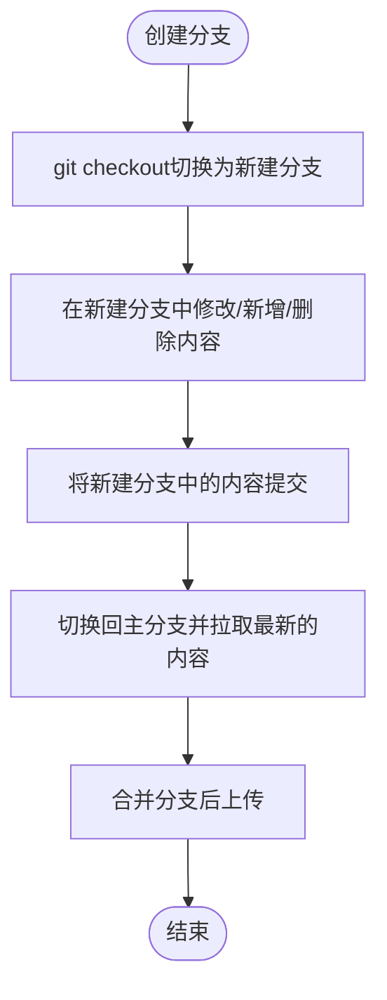

@[TOC](git分支的使用、冲突的处理以及版本回退)

# git分支的作用简介

在进行多人协作开发的时候，为了防止互相干扰，**提高协同开发的体验和效率**。建议每个开发者都
**基于分支**进行项目开发和迭代。**分支有利于在原有的代码的基础上进行原有代码的修改以及其他功能的开发。**

## 分支的使用方法

### 1、分支的创建
使用如下命令，可以基于当前分支，创建一个新的分支，此时，新分支中的代码和当前分支完全一致。
```bash
git branch <分支名>          # 仅创建分支,此时与主分支的内容是相同的
git checkout -b <分支名>     # 创建并切换到该分支
```

### 2、分支的切换

```bash
git checkout <分支名>        # 切换到已有分支
```

### 3、分支的查看

```bash
git branch                  # 本地分支
git branch -a               # 包含远程分支
```

### 4、分支的合并

```bash
git merge <分支名>  
```

### 5、分支的更新

```bash
git fetch origin                   # 获取远程分支信息
git pull origin <分支名>           # = fetch + merge
git pull --rebase origin <分支名>  # = fetch + rebase（推荐）
```

## 分支的使用过程



## 冲突的处理
### 冲突出现的常见场景

```bash
git merge    #分支合并
git rebase main #变基操作
git pull origin main # 相当于 git fetch + git merge
```
### 处理冲突过程
#### 1、冲突的呈现

```bash
Auto-merging [文件名]  # 尝试自动合并但失败的文件
CONFLICT (content): Merge conflict in [文件名]  # 明确标记该文件存在内容冲突
Automatic merge failed; fix conflicts and then commit the result.  # 提示需要手动解决冲突后提交
```
#### 2、识别冲突文件

```bash
git status
```
* 查看 **Unmerged paths** 下列出的冲突文件
* 查看文件中的冲突标记

#### 3、标记冲突已解决

```bash
git add <file>  # 对每个解决后的文件执行
# 或一次性添加所有
git add .
```
#### 4、完成合并

```bash
git commit  # 会自动生成合并提交信息
git rebase --continue
```

#### 5、推送

```bash
git push 
```

## 版本回退
### 1、软回退

```bash
git reset --soft HEAD~1  # 回退到上一个提交，保留所有修改
```
* 仅回退提交历史，保留工作区和暂存区的修改
### 2、混合回退

```bash
git reset HEAD~1  # 取消最近一次提交，修改保留在工作区
```
* 回退提交历史并取消暂存，但保留工作区文件
### 3、硬回退

```bash
git reset --hard <commit-hash>
```
* 彻底回退到指定版本，丢弃所有后续修改
### 4、撤销单个提交

```bash
git revert <commit-hash>
```
* 生成一个逆向提交来抵消指定提交的修改
### 5、检出旧版本

```bash
git checkout <commit-hash>
```
* 临时切换到历史版本（只读状态）

